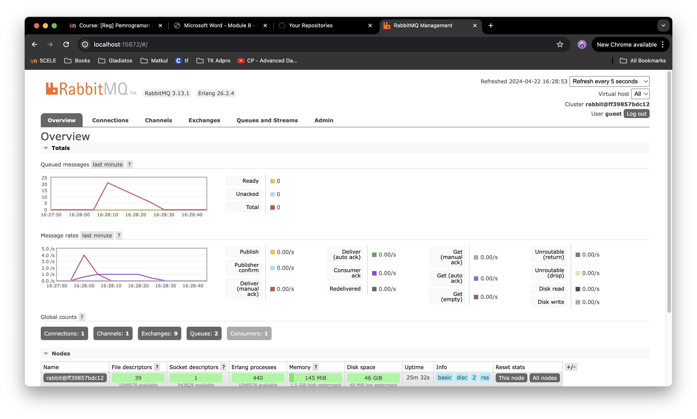

### Adpro Tutorial 8: Subscriber
## What is amqp?
AMQP stands for Advanced Message Queueing Protocol. It's a protocol for message-oriented middleware. 

## what it means? guest:guest@localhost:5672 , what is the first quest, and what is the second guest, and what is localhost:5672 is for?
guest:guest@localhost:5672 is the default username and password for RabbitMQ. The first guest is the username and the second guest is the password. localhost:5672 is the default host and port for RabbitMQ.

## Simulation slow subscriber 

The number of queue in my chart is also 20. I guess the number of queue is 5 times the number of time we run the publisher, becase the publisher sends 5 messages to the message broker in one run. I ran the publisher 4 times, so the number of queue is 20.