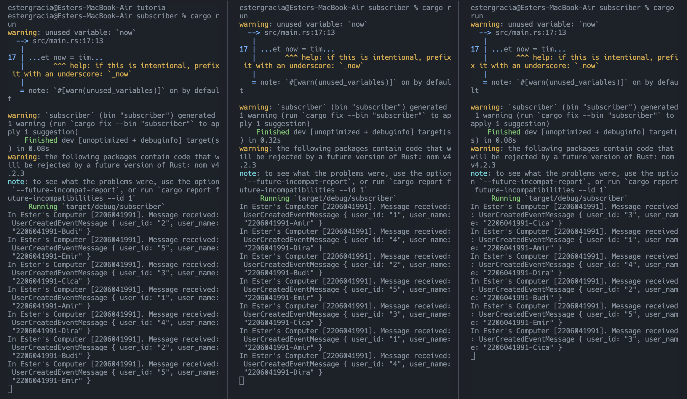
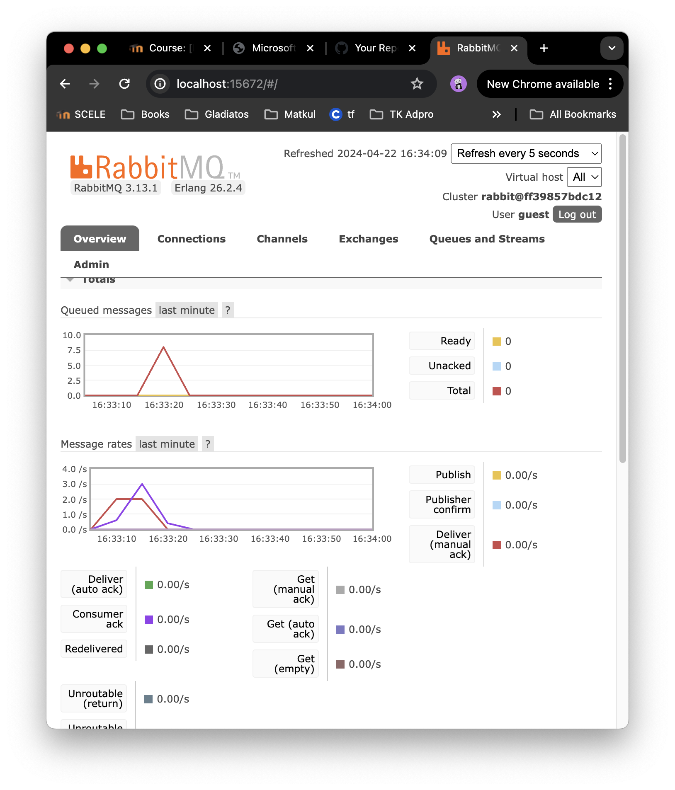

### Adpro Tutorial 8: Subscriber
## What is amqp?
AMQP stands for Advanced Message Queueing Protocol. It's a protocol for message-oriented middleware. Unlike HTTP, which is a text-based protocol, AMQP is a binary protocol. It means that AMQP is designed to be more efficient and more secure. AMQP has a number of features that make it well-suited for messaging applications. The features include support for message queuing, routing, and delivery, as well as support for transactions and security. 

## what it means? guest:guest@localhost:5672 , what is the first quest, and what is the second guest, and what is localhost:5672 is for?
guest:guest@localhost:5672 is the default username and password for RabbitMQ. The first guest is the username. Meanwhile, the second guest is the password. localhost:5672 is the host and port for RabbitMQ. It means that RabbitMQ is running on the local machine and listening on port 5672. 5672 is the default port for RabbitMQ.

## Simulation slow subscriber 

The number of queue in my chart is also 20. I guess the number of queue is 5 times the number of time we run the publisher. It is becase the publisher sends 5 messages to the message broker in one run. I ran the publisher 4 times. The number of queue is 20, as shown above. The spike is reduced slowly due to the high number of queues and slow subscriber. 

## Running multiple subscribers

The spike of the message queue is reduced quicker than before. It's because message queue is distributed to multiple subscribers. In this experiment, I ran 3 subscribers as shown in the first image. Then, I ran the publisher 4 times. The result is, the 20 messages is distributed to the 3 subscribers. It's shown in the first image that the message is distributed and in the second image the spike is reduced quicker.